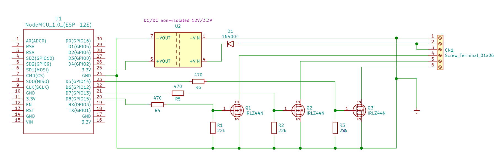

# RGB-LED-strip-esp8266

This is a project to drive RGB led strips with ESP8266 (nodeMCU module).

The activation is done through a local web interface.

On devices that work with a ".local" domain, the page can be loaded by name. For example: led-10c3b4.local. For other cases, the interface is accessed by IP. Ex .: 192.168.0.101.

The web page is served by ESP8266 on TCP port 80.

To ensure agility, the interaction of the color selection is done using [websockets](https://github.com/gilmaimon/ArduinoWebsockets) on TCP port 81 and messagens in [JSON](https://github.com/bblanchon/ArduinoJson) format.

The firmware accepts updating using OTA on port 82 or via the serial interface.

In the platformio.ini file, you can customize your project by adding the code below:
```
build_flags = 
  '-D WIFI_SSID="WIFI-SSID"'
  '-D WIFI_PASS="WIFI-PASS"'
  '-D PIO_FRAMEWORK_ARDUINO_LWIP2_HIGHER_BANDWIDTH'
  '-D PCI_VERSION_2'
```

The Project was made using the [Visual Code IDE](https://code.visualstudio.com/download), [Platformio](https://platformio.org/install/ide?install=vscode) and [Arduino Framework](https://docs.platformio.org/en/latest/platforms/espressif8266.html) for Espressif ESP8266;

The color Picker uses the lib available at [https://github.com/jaames/iro.js](https://github.com/jaames/iro.js)

For [RGB/HSL](https://github.com/marcio-cp/cocoa-press-marlin/blob/master/Marlin/src/lcd/extui/lib/ftdi_eve_touch_ui/ftdi_eve_lib/extended/rgb_t.h) conversion routines: credits to [Marcio Teixeira](https://github.com/marcio-cp)

[](https://youtu.be/vLKXMp9dhpw)

[](https://youtu.be/u9i37xKtStI)





